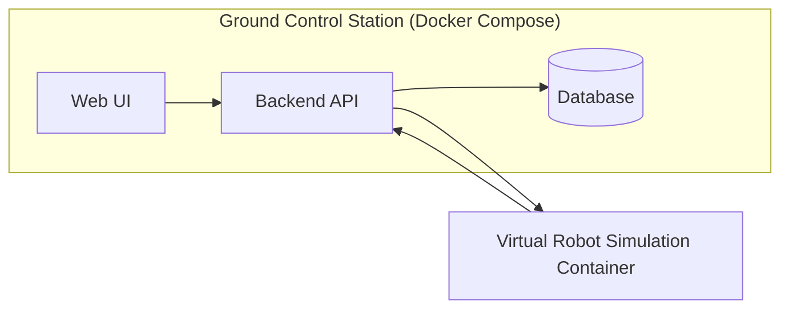
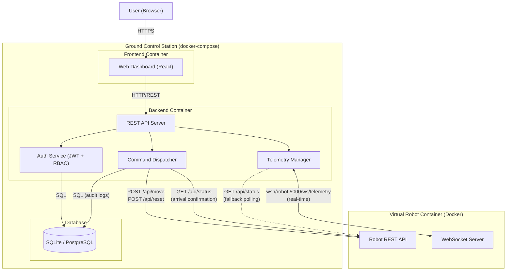

# Robot Management System – CMP9134

## Overview

This project implements a web-based Ground Control Station for a Virtual Robot Simulation.  
The system enables authenticated users to monitor and control a simulated robot operating within a 2D grid environment.

The application demonstrates:

- Role-Based Access Control (RBAC)
- Real-time telemetry handling
- Map-aware navigation validation
- Audit logging
- Layered architecture (Controller → Service → Repository)
- Docker-based simulation integration
- Ethical and dual-use awareness

---

## System Architecture

The following component diagram illustrates the high-level system structure and interaction between the application and the simulation container.

## Component Diagram 

The following component diagram illustrates the high-level system structure and interaction between the application and the simulation container.

